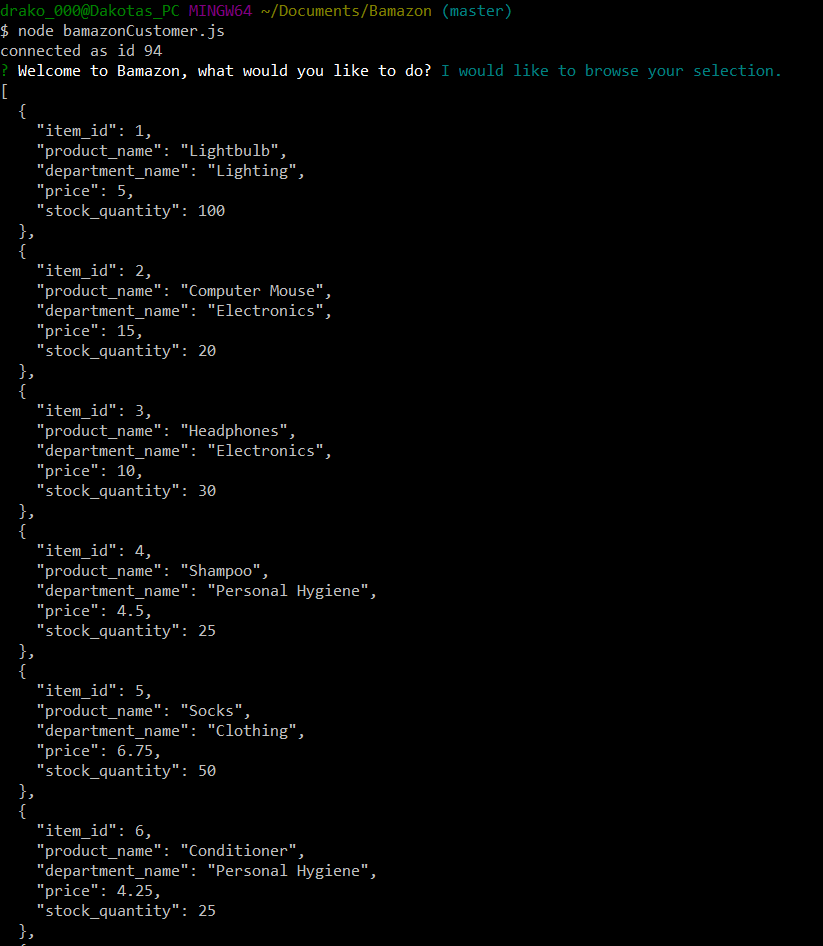
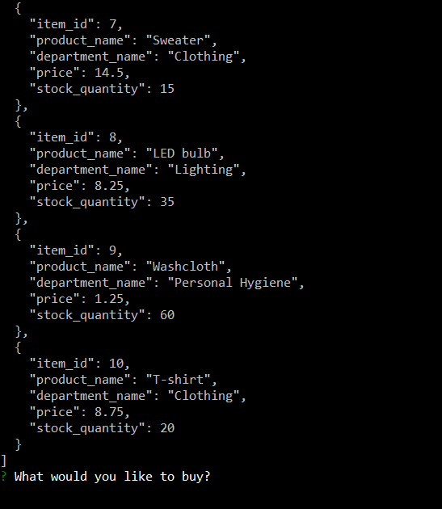
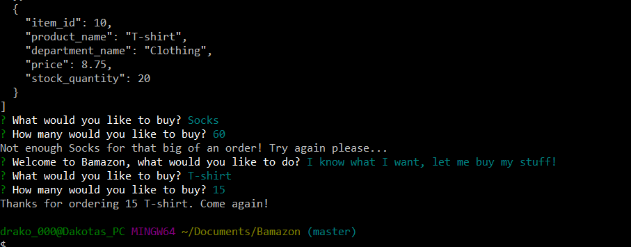
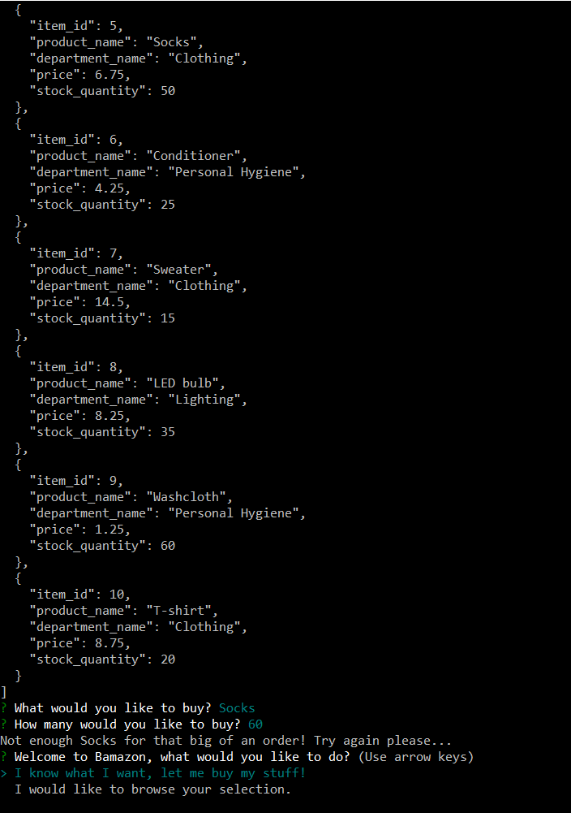

# Bamazon

* This program is designed to simulate a very simple Amazon storefront.

* It is designed to take in user input, and display information according to what it's given.

* It will also prevent the user from "purchasing" too much of a given product, if the requested amount is more than the value.

# Screenshots
* Beginning

* Second half of Beginning

* Confirm Screen

* Error upon ordering too much

